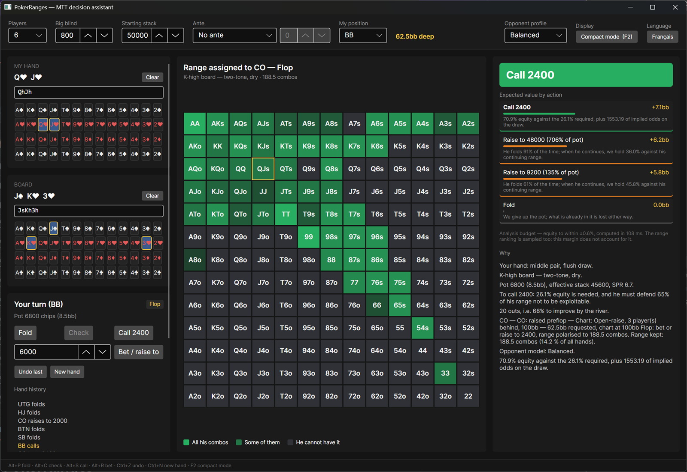
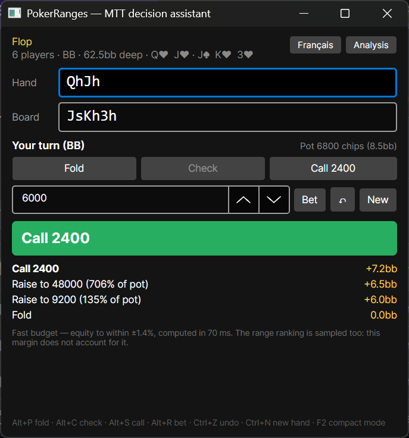
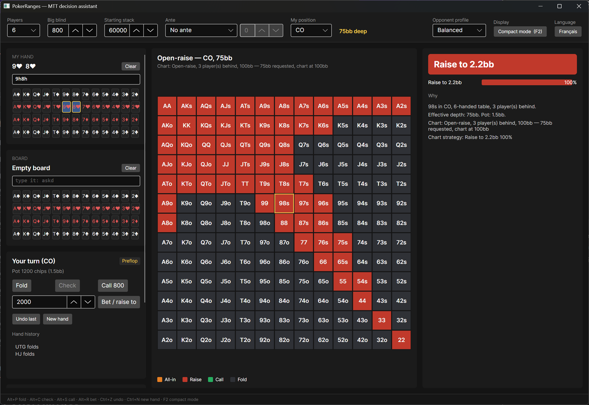

# PokerRanges

[](https://github.com/Julien-FONTANA/PokerRanges/actions/workflows/build.yml)
[](https://github.com/Julien-FONTANA/PokerRanges/releases)


[](LICENSE)

A decision assistant for No Limit Texas Hold'em tournaments. A desktop application that follows the
hand at the pace it is played and answers a single question: **what do I do, and why?**

Preflop, the answer comes from a chart, and the application says which one and what it had to round
off to get there. Postflop, it rebuilds each opponent's range from what they actually did, then
compares the expectation of every action under an explicit opponent response model. The reasoning is
shown in full: no advice arrives without its justification.

French and English interface, switchable on the fly.



*Analysis mode. Facing a flop bet with middle pair and a flush draw: the range the opponent is
credited with, the expectation of every action, and the reasoning that got there.*

---

## What it does

- **Chart-based preflop advice** — the context is recognised automatically (open, facing an open,
  squeeze, facing a 3-bet, short stack…), along with position, depth and the number of players
  behind. Mixed frequencies are shown when several actions are playable.
- **Expectation-based postflop advice** — each bet size is evaluated against the sub-range that
  *calls*, not against the starting range. That is where naive tools go wrong.
- **13×13 grid** — the preflop chart's strategy, or the range assigned to the opponent postflop,
  including the combos the board and your own cards deny them.
- **Four opponent profiles** — balanced, tight, calling station, aggressive. Change the profile and
  the advice changes with it.
- **Head-to-head calculator** — a third mode (`F3`) for the spot a final table comes down to: your
  range against one opponent's, at an explicit effective stack, with the expectation of jamming,
  calling and folding. Each side is entered by clicking the grid, typing the range, or dragging a
  strongest-X% slider; opening it copies the hand in progress across.
- **Tables from 2 to 8 players**, uneven stacks, regular antes or big blind antes.
- **Compact mode** — a reduced, always-on-top window with cards typed from the keyboard
  (`askd`, `ks8d3c`), designed to answer in under a second while you are playing.
- **Hand journal** — an entry keeps the whole hand, not a summary: reload it and replay the decision
  with a different profile or a different size.
- **Automatic resume** — the hand in progress and the settings survive shutdown.



*Compact mode, the same hand: cards typed instead of clicked, always on top, and a reduced
calculation budget so the answer arrives while it is still your turn.*

---

## How it reasons

The interesting part is postflop. For each opponent still in the hand:

1. **Starting range** — read the chart matching the situation they acted in, and keep the branch
   matching their actual action (they raised → their raising range).
2. **Removing impossible combos** — the board and your two cards block combinations; those leave the
   range before any calculation.
3. **Narrowing street by street** — each postflop action shrinks the range. A bet polarises it (best
   hands for value, a tail of weak ones for bluffs); a call keeps only the share the minimum defence
   frequency justifies, shifted by the profile.
4. **Ranking by strength** — each combo is ranked by its equity against the range itself on this
   board. A measured ranking, not a hand-written bonus table: that is what correctly values a flush
   draw against a small pair.
5. **Expectation of each action** — for every size considered, compute the probability the opponent
   folds, and the equity **against what continues**. A draw's implied odds, equity realisation in
   and out of position, and the opponent's re-raise heads-up are all modelled.

The calculation is deterministic: the same situation gives the same advice. Monte-Carlo sampling
starts from a fixed seed, and the advice states the standard error it reached.

---

## Getting started

You need the **.NET 10 SDK**.

```bash
git clone https://github.com/Julien-FONTANA/PokerRanges.git
cd PokerRanges
dotnet run --project src/PokerRanges.App
```

The tests:

```bash
dotnet test
```

372 tests: 264 for the domain, 55 for the data, 53 driving the main window end to end. To measure
coverage, as continuous integration does:

```bash
dotnet test --collect:"XPlat Code Coverage"
```

The three test projects each produce their own report; they have to be merged to read the real
coverage. The workflow does that and shows the result in the run summary.

To produce the self-contained executable (Windows, no .NET required on the target machine):

```powershell
.\publish.ps1
```

The script runs the tests first — publishing a binary nobody has checked is asking to have to recall
it. `-SkipTests` for a quick round trip, `-ReadyToRun` for snappier startup at the cost of a bigger
file. The result is a single `PokerRanges.exe` in `publish/win-x64/`.

---

## Shortcuts

| Key | Action |
|---|---|
| `Alt+P` | Fold |
| `Alt+C` | Check |
| `Alt+S` | Call |
| `Alt+R` | Bet / raise |
| `Ctrl+Z` | Undo the last action |
| `Ctrl+N` | New hand |
| `F2` | Toggle compact / analysis mode |
| `F3` | Toggle the head-to-head calculator |

Bare letters are reserved for card entry, where `c`, `d`, `h` and `s` are suits and not actions.

---

## The preflop charts

The shipped charts are embedded in the application, then copied on first launch into an editable
directory:

```
%APPDATA%\PokerRanges\charts\
```

A file in that directory replaces the shipped chart with the same key. Edit a range, click
**Reload** in the application, and the advice changes without a restart. **Restore originals**
rewrites the shipped files over the top — so a range can be broken without fear.

The format is JSON, with ranges in the usual notation:

```json
{
  "source": "Standard tournament opening ranges at ~100bb",
  "charts": [
    {
      "context": "RaiseFirstIn",
      "playersLeftToAct": 3,
      "depthInBigBlinds": 100,
      "actions": [
        {
          "kind": "Raise",
          "sizeInBigBlinds": 2.2,
          "range": "22+, A2s+, K6s+, Q8s+, J8s+, T7s+, 96s+, 86s+, 75s+, 65s, 54s, A8o+, KTo+, QTo+, JTo"
        }
      ]
    }
  ]
}
```

Folding is never written: it is whatever remains once the other actions are subtracted, so no hand
can be forgotten. When no chart matches exactly, the application names a single one — it never
blends two charts — and shows every compromise it made.



*Preflop, opening from the cutoff. The grid is the chart's strategy, and the advice names the chart
it was read from along with what it had to round off: 75bb asked for, 100bb answered.*

---

## Where the files live

| Path | Contents |
|---|---|
| `%APPDATA%\PokerRanges\charts\` | The preflop charts, editable |
| `%APPDATA%\PokerRanges\settings.json` | Table settings, profile, language |
| `%APPDATA%\PokerRanges\journal.json` | The hand journal |
| `%LOCALAPPDATA%\PokerRanges\hand-in-progress.json` | The interrupted hand, to resume |
| `%LOCALAPPDATA%\PokerRanges\logs\` | Execution logs |

---

## Architecture

```
src/
  PokerRanges.Core    The domain. Cards, ranges, evaluator, equity, pot engine,
                      preflop and postflop advice. Depends only on logging abstractions.
  PokerRanges.Data    The JSON charts and persistence. Knows nothing about the interface.
  PokerRanges.App     Avalonia + MVVM. Contains no poker rules.
tests/
  …Core.Tests         The domain, case by case.
  …Data.Tests         Charts, resolution, persistence.
  …App.Tests          The main window, driven as a user would drive it.
```

A few pieces worth the detour:

- **`RankCountHandEvaluator`** — evaluates 5 to 7 cards by counting ranks, with no allocation and no
  precomputed table.
- **`HandReplay`** — replays the hand action by action: antes, blinds, per-street commitments,
  stacks, folded players, and who has to act. The board is what settles the street.
- **`EquityCalculator`** — switches on its own between exhaustive enumeration and Monte-Carlo
  depending on cost, samples by rejection to respect the joint distribution of overlapping ranges,
  and stops on the target standard error.
- **`ChartResolver`** — picks the closest chart and records every compromise, so a piece of advice
  can always be traced back to the data that produced it.
- **`PreflopHandStrength`** — the 169 starting hands ordered by their equity against a random hand,
  which is what "the strongest 20%" means. Shipped as a measured table rather than recomputed at
  startup: neighbouring hands are about three tenths of a point apart, so telling them apart takes
  a million samples each, and it is a constant of the game rather than of the session. The test
  project holds the generator that rewrites it.
- **`Language`** — the current language *is* `CurrentUICulture`. Numbers therefore follow without
  anyone thinking about it, and the culture crosses `await` and the thread pool.

The model's assumptions (`PostflopOptions`) are kept separate from the cost of computing
(`PostflopBudget`): the first describes what is assumed about the game, the second what we accept
to spend measuring it.

---

## Known limitations

They are assumed, not hidden — the application flags several of them on screen.

- **The charts are a starting point, not solver output.** Several contexts have no data of their own
  (facing a 3-bet, facing a 4-bet, squeeze, facing limps) and fall back on a neighbouring context.
  The depths covered are 10, 25 and 100bb; in between, the application takes the closest chart and
  says so.
- **No ICM.** Every expectation is in chips — the head-to-head calculator included, which is
  awkward given it exists for final tables. It says so on screen. Near a bubble or a final table,
  chips are the wrong currency.
- **One-shot decisions.** Expectation is computed as though the hand ended on this street: there is
  no plan for betting the following ones.
- **Multiway is approximated.** Beyond heads-up, the opponent's re-raise is not modelled and
  opponents are treated as independent. The advice says so.
- **No side pots.** Uneven stacks are modelled, but a multiway all-in showdown does not yet split
  the pot into several parts.
- **Windows x64 publishing only**, even though Avalonia is cross-platform.

---

## Contributing

Contributions are welcome, and the most useful limitation to push back is not code: it is the
charts. Several situations have no data of their own and fall back on a neighbour, and adding a
chart takes nothing but JSON.

The [contributing guide](CONTRIBUTING.md) covers how the code is laid out, the conventions, and the
chart format. See also the [code of conduct](CODE_OF_CONDUCT.md) and the
[security policy](SECURITY.md).

The repository is written in English — code, comments and documentation alike. The **user
interface** is a different matter: it ships in both French and English, and everything under
`Localization/` must keep both.

A security issue is not reported in a public ticket: see [SECURITY.md](SECURITY.md).

## License

[MIT](LICENSE) — © 2026 Julien Fontana.
